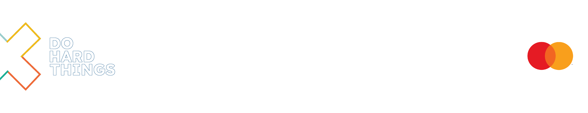

<p align="center">
  
</p>
  
# ALX iSwE HTML & CSS PROJECTS 

# Table of Contents

- [Introduction](#introduction)
- [Learning Objectives](#learning-objectives)
- [Prerequisites](#prerequisites)
- [Project Structure](#project-structure)
- [Instructions](#instructions)
- [ALX_Learner](#ALX_Learner)


## Introduction

This projects focuses on mastering the HTML (HyperText Markup Language) and CSS (Cascading Style Sheets) to following the HTML structures and enhance the visual appeal and layout of your web pages. By the end of this project, you will have a solid understanding of HTML & CSS fundamentals and how to apply them to create stylish and responsive webpages.


- Programing Language used in this Project :
<br>


## Learning Objectives

By completing this project, you are expected to:

- Understand the basics of HTML.
- Create an HTML page from a wireframe.
- Gain knowledge of markup languages.
- Understand the Document Object Model (DOM).
- Comprehend HTML elements and tags.
- Recognize and use attributes in HTML.
- What is CSS
- How to add style to an element
- What is a class
- What is a selector
- How to compute CSS Specificity Value
- What are Box properties in CSS
- How does the browser load a webpage

## Prerequisites

Before starting this project, it is recommended to have a basic understanding of HTML and CSS.

## Project Structure

The project structure is organized as follows:

- `alx_html_css/`
    - `css_basic/`
        - `index.html` 
        - `tweets.html`
        - `base.css` 
        - `style.css` 
        - `banner.jpg`
        - `README.md` 
    - `html_advanced/`
        - `index.html` 
        - `media` 
        - `README.md`
    - `html_basic`:
        - `base_index.html`
        - `index.html`
        - `tweets.html`
        - `README.md`
- `README.md`


## Instructions

1. Clone the repository.

```bash
    git clone https://github.com/your-username/alx_html_css.git
```

Replace `your-username` with your GitHub username.


```bash
    cd alx_html_css
```


## ALX_Learner

<h4 align="center">SOUFIANE AKHAIT</h4>

<h5 align="center"><i>You can find me here</i></h5>
<br>
<p align="center">
  <a href="https://www.instagram.com/akhiat.soufiane" target="_blank"></a>
  <space>     </space><a href="https://github.com/sfanxAK" target="_blank"></a>
  <space>     </space> <a href="https://twitter.com/MrSloplop" target="_blank"></a>
</p>
<br>
<p align="center">
  
  <space>     </space>
</p>

---

**Happy Coding! 😊**
